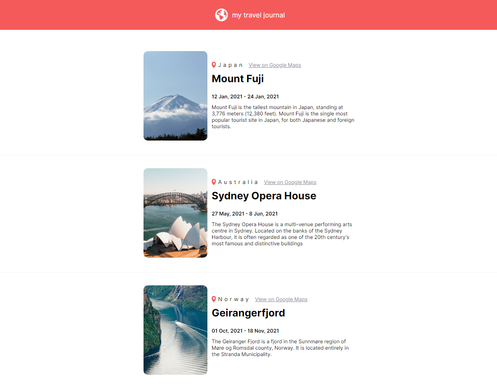

# React Static Site - Project README



This repository contains a React static site project that utilizes props to create a dynamic user interface. The site is hosted on Netlify and can be accessed at [https://mellifluous-dolphin-20ef16.netlify.app/](https://mellifluous-dolphin-20ef16.netlify.app/).

## Table of Contents

- [Introduction](#introduction)
- [Features](#features)
- [Demo](#demo)
- [Installation](#installation)
- [Usage](#usage)
- [Technologies Used](#technologies-used)
- [Contributing](#contributing)
- [License](#license)

## Introduction

This is a simple static site built with React, showcasing the usage of props to create dynamic components. Props are an essential feature in React that allows you to pass data from a parent component to its child components. This project demonstrates how you can leverage props to render different content and components based on the data passed.

## Features

- Display dynamic content using props
- Stylish and responsive user interface
- Easy-to-use and understand code structure

## Demo

Check out the live demo of the project at [https://mellifluous-dolphin-20ef16.netlify.app/](https://mellifluous-dolphin-20ef16.netlify.app/).

## Installation

To run this project locally, follow these steps:

1. Ensure you have Node.js installed on your machine.
2. Clone this repository to your local machine using the following command:

```
git clone <repository_url>
```

3. Navigate to the project directory:

```
cd my-react-static-site
```

4. Install the required dependencies:

```
npm install
```

## Usage

Once you have installed the dependencies, you can start the development server:

```
npm start
```

This will start the development server, and you can access the site in your web browser at [http://localhost:3000](http://localhost:3000).

Feel free to modify the components, add new props, and experiment with different content to see how the site dynamically responds to the changes.

## Technologies Used

The project uses the following technologies:

- React
- HTML5
- CSS3
- JavaScript
- Netlify (for deployment)

## Contributing

Contributions are welcome! If you find any issues or want to enhance the project, feel free to create a pull request. Before contributing, please review the [Contribution Guidelines](CONTRIBUTING.md).

## License

This project is open-source and available under the [MIT License](LICENSE).

---

Thank you for checking out this project! If you have any questions or feedback, please feel free to create an issue or contact the project maintainers. Happy coding!
